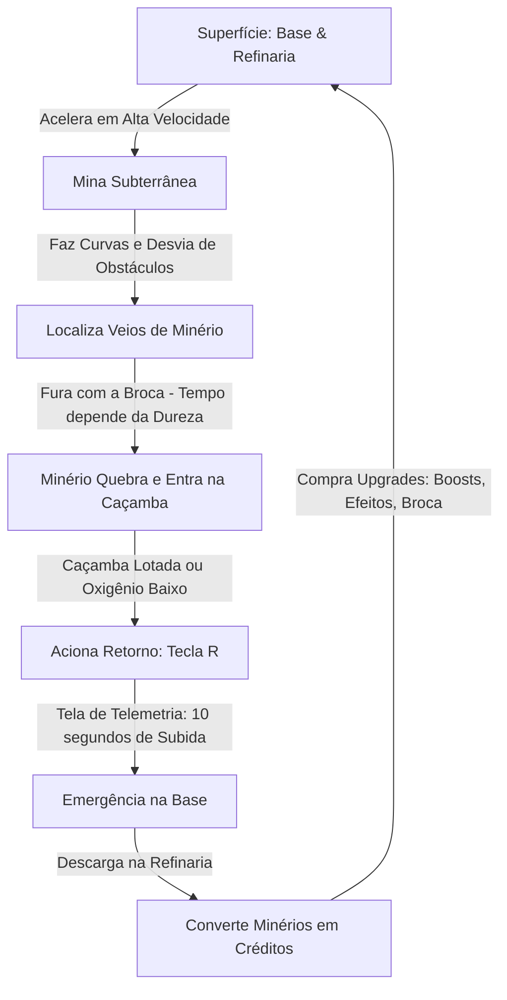

# Game Design Document (GDD) — Oh-Mars: Subsurface Extraction Protocol

## 1. Visão Geral do Projeto

* **Título:** Oh-Mars: Subsurface Extraction Protocol
* **Tema Principal:** Mineração e Extração de Recursos In-Situ na subsuperfície de Marte.
* **Contexto de Criação:** Hackathon Space Apps.
* **Plataforma:** Web (PlayCanvas 3D Engine + TypeScript + Vite).
* **Gênero:** Mineração e Exploração Arcade de Alta Velocidade (*Fast-Paced Mining Runner*).
* **Inspiração Visual e Estética:** **Astroneer** (geometria limpa, low-poly estilizado, materiais foscos com cores marcianas vibrantes e neons brilhantes para minérios e faróis).

---

## 2. Pilares de Design (Design Pillars)

1. **Velocidade e Dinamismo:**
   A broca é um veículo ágil, veloz, capaz de fazer curvas fechadas, derrapar e navegar rapidamente pelas galerias subterrâneas.

2. **Dureza e Resistência Variada das Rochas:**
   Nem toda rocha quebra no mesmo tempo. Rochas mais macias e veios superficiais quebram rápido, enquanto rochas densas de basalto e minérios raros profundos exigem mais tempo de perfuração e brocas aprimoradas.

3. **Economia de Créditos e Upgrades Reais:**
   Sem "pontos genéricos". Minérios entregues na refinaria são convertidos diretamente em **Créditos**. Os créditos financiam melhorias imediatas para o veículo: **Boosts/Nitro**, **Brocas mais Rápidas**, **Capacidade de Caçamba** e **Efeitos Visuais/Cosméticos**.

4. **Tensão Natural (Sem Cronômetro Artificial):**
   A expedição termina por dois fatores físicos da missão:
   - **Capacidade da Caçamba:** Atingiu o limite de transporte.
   - **Oxigênio do Traje:** Drena conforme você explora.
   - **Falha por Hipóxia (O2 Zerado):** Se o oxigênio acabar no subsolo, o astronauta **desmaia**. O guincho de emergência o transporta de volta para a base, mas aplica uma **penalidade de perda de 40% dos minérios** que estavam na caçamba.

5. **Retorno Automático com Risco de Subida (Tela de Telemetria de ~10s):**
   Retorno voluntário via tecla `[R]` (segurar por 1s para ancorar). A subida pelo guincho leva **$\sim 10$ segundos** com tela esquemática de telemetria mostrando a subida metro a metro. **O oxigênio continua sendo consumido durante esses 10 segundos de subida**: se o jogador acionar o retorno com oxigênio insuficiente para aguentar os 10s de tração, ele desmaia no percurso e sofre a penalidade de 40%!

6. **Objetivo Supremo da Missão (Conquista do Xenônio):**
   A grande consagração da missão é perfurar até as profundezas extremas, encontrar o veio de **Xenônio** e entregá-lo intacto na base da superfície. Esse objetivo conta com indicativos claros no painel/HUD (ex: frequência sísmica e medidor de profundidade), guiando o jogador sem nunca travar ou atrapalhar sua progressão livre e upgrades.

---

## 3. O Core Loop do Jogo

---

## 4. Mecânicas Detalhadas

### 4.1. O Veículo Broca (Drill Rover)
* **Controles:**
  - `W` / `S`: Aceleração ágil e ré.
  - `A` / `D`: Esterçamento com derrapagem controlada em curvas rápidas.
  - `Shift`: Aciona o **Boost / Nitro** (disparo em alta velocidade que também **multiplica a força de impacto da broca** enquanto estiver ativo).
  - `Botão Esquerdo` ou `Espaço`: Aciona a rotação da broca frontal com faíscas e efeitos de luz.
* **Componentes Visuais:**
  - Chassi estilo *Astroneer* com cores limpas.
  - 4 rodas com pneus de tração que giram em tempo real.
  - Broca cônica frontal espiralada.
  - Faróis duplos para iluminar a escuridão do subsolo.
  - Caçamba traseira que exibe fisicamente os blocos de minério minerados.

### 4.2. Estética Visual Astroneer (Low-Poly Facetado)
* **Flat-Shaded / Faceted Geometry:** Malhas low-poly com normais planas visíveis (facetadas), dispensando texturas realistas pesadas ou ruídos visuais.
* **Paleta de Cores Marciana Vibrante:** Tons quentes e limpos (laranja terracota, vermelho ocre, areia vulcânica) contrastando com minérios brilhantes (azul ciano, ouro metálico, roxo profundo).
* **Iluminação e Silhueta:** Sombras nítidas de sol marciano, holofotes frontais direcionais cortando o túnel escavado e partículas luminosas de impacto.

### 4.3. Comportamento do Terreno e Escavação (Estilo Astroneer)
Ao contrário de jogos onde blocos cúbicos soltos desaparecem (estilo Minecraft), a escavação segue o comportamento orgânico e contínuo de **Astroneer**:
* **Deformação de Malha / Escavação Orgânica:** A ponta da broca atua com um raio de escavação esférico/cônico que deforma e rebaixa a malha poligonal do terreno em tempo real.
* **Criação de Rampas e Túneis:** Conforme a broca avança e fura para baixo ou para a frente, ela esculpe valas e passagens com paredes facetadas low-poly, permitindo que as 4 rodas do rover desçam fisicamente para dentro da vala/cratera criada.
* **Impacto do Boost na Escavação (Velocidade = Força):**
  - Acionar o turbo (`Shift`) enquanto perfura transforma o rover em um verdadeiro **aríete**: a força da broca é amplificada drasticamente durante o boost, permitindo romper rochas pesadas e veios duros muito mais rápido pelo ímpeto cinético.
* **Dureza e Resistência de Materiais:**
  - **Solo Macio / Regolito Superficial:** Cava com facilidade ($\sim 0.5\text{s}$), permitindo abrir passagens em alta velocidade.
  - **Gelo Glacial ($H_2O$ - Ciano):** Quebra em $\sim 1.0\text{s}$, concedendo créditos e **reabastecendo oxigênio de emergência (+20% O2)**.
  - **Silicato Energético (Dourado):** Quebra em $\sim 1.5\text{s}$, concedendo créditos e recarregando o boost.
  - **Basalto Denso / Titânio (Roxo):** Quebra em $\sim 2.5\text{s}$, exigindo persistência da broca ou melhorias no motor de perfuração (ou aríete com boost!).
  - **Xenônio / Cristais Raros (Magenta):** Rocha ultra-dura ($\sim 3.5\text{s}$), encontrada nas profundezas, concede créditos massivos.
* **Desprendimento e Coleta:** Ao atingir o tempo de quebra do veio, pepitas facetadas de minério soltam-se da parede esculpida e voam magneticamente para a caçamba traseira do rover.

### 4.4. Terminal da Loja e Refinaria (Exclusivo na Base da Superfície)
A loja fica fisicamente situada na **Base Marciana de Superfície** (ao lado do pad de telemetria / guincho). O jogador só pode acessar as compras e refinarias quando estiver ancorado na base:
1. **Módulo de Boost / Nitro:** Aumenta a aceleração, duração e força cinética de impacto do turbo.
2. **Potência da Broca:** Reduz o tempo base de perfuração das rochas duras.
3. **Expansão de Caçamba:** Aumenta a capacidade de carga de 6 para 8 e 12 unidades.
4. **Tanque de Oxigênio Expandido:** Permite expedições mais longas e profundas.
5. **Efeitos Visuais e Cosméticos:** Chamas de escape personalizadas para o boost (plasma azul, fogo marciano), pinturas para o chassi e faróis de neon.

### 4.5. Sistema de Retorno Automático (Tela de Telemetria de ~10s)
* **Ativação:** Segurar `[R]` por 1 segundo parado para engatar o cabo de tração.
* **Tela de Telemetria e Subida ($\sim 10$ segundos):**
  - Painel esquemático de computador de bordo mostrando a subida em metros: `-120m` $\rightarrow$ `-90m` $\rightarrow$ `-60m` $\rightarrow$ `-30m` $\rightarrow$ `-10m` $\rightarrow$ `0m (SUPERFÍCIE)`.
  - Barra de tração do guincho mecânico e som de alta rotação dos motores de recolhimento.
  - **Consumo Contínuo de Oxigênio:** O suporte de vida continua drenando durante esses 10 segundos de subida. Se o oxigênio zerar antes do rover atingir a superfície ($0\text{m}$), o astronauta sofre hipóxia em trânsito e o resgate médico aplica a penalidade de $40\%$ na carga.
* **Chegada:** Desacoplamento suave com o veículo estacionado na plataforma de refino.

### 4.6. Suporte de Vida, Hipóxia e Vitória Suprema
* **Falha de Oxigênio (Desmaio e Resgate):**
  - Quando a barra de $O_2$ chega a zero, a visão escurece (fade-out cinemático) com som de aviso médico.
  - O sistema de suporte vital aciona o recolhimento forçado de emergência para a base.
  - O jogador reaparece na base com $100\%$ de $O_2$ restaurado, mas com **aviso de perda de 40% dos minérios** que estavam na caçamba (custo do resgate médico).
* **A Conquista do Xenônio (Vitória da Missão):**
  - **Indicativos Orgânicos:** O computador de bordo do rover e o painel da base possuem um mostrador sutil de "Sinal de Ressonância de Xenônio" que aponta a distância e profundidade aproximadas (ex: `Sinal Detectado a -120m`).
  - **Não intrusivo:** Esse indicador não bloqueia a tela nem força o jogador; ele serve como bússola de longo prazo enquanto o jogador minera, upa e se diverte no seu ritmo.
  - **Final Triunfal:** Ao quebrar a rocha de Xenônio, carregar o cristal na caçamba e acionar o retorno com sucesso até a plataforma de refino, a missão principal é concluída com louvor (tela de vitória da missão NASA).

---

## 5. Roadmap de Implementação por Features (Ordem de Execução)

1. **Feature 1: O Veículo Broca com Alta Velocidade, Curvas e Boost**
   - Chassi visual estilo Astroneer, aceleração ágil, esterçamento fluido e turbo no `Shift`.
2. **Feature 2: Broca Frontal, Escavação Deformável Estilo Astroneer e Rochas com Diferentes Durezas**
   - Deformação contínua de malha/terreno facetado com raio esférico da broca abrindo rampas/valas para o rover descer, e minérios com durezas distintas.
3. **Feature 3: Caçamba de Carga e Limitador de Oxigênio**
   - Armazenamento físico de minérios e dreno natural do oxigênio.
4. **Feature 4: Tela de Telemetria de Retorno Automático (~10s)**
   - Tecla `[R]`, overlay de subida em metros em 10 segundos com consumo de O2 e docagem na base.
5. **Feature 5: Refinaria, Sistema de Créditos e Loja de Upgrades**
   - Conversão de minério em créditos e compra de melhorias (boost, broca, capacidade e efeitos).
